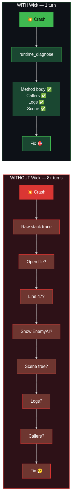
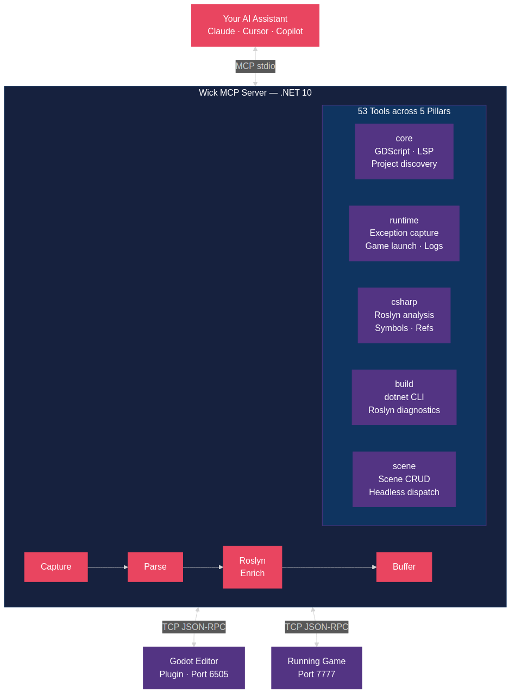

<a href="https://github.com/buildepicshit"></a>

# Wick

**Roslyn-enriched C# exception telemetry for Godot Engine, exposed over MCP.**

[](https://github.com/buildepicshit/Wick/actions/workflows/ci.yml)
[](LICENSE)

---

## What is Wick?

When a Godot C# game crashes, your AI assistant sees a raw stack trace and spends 8+ turns asking you to open files. Wick captures that exception, enriches it with Roslyn-powered source context (the actual method body, caller chain, recent logs, scene state), and hands the full picture to the AI in one call. **One turn to diagnosis instead of ten.**

### What makes Wick different?

Other Godot MCP servers (like the excellent [GoPeak](https://github.com/HaD0Yun/Gopeak-godot-mcp)) focus on scene manipulation and GDScript tooling. Wick focuses on the C#/.NET developer experience:

- **Roslyn-enriched exception telemetry** -- stderr-captured C# exceptions enriched with the calling method body, surrounding source lines, enclosing type, and caller chain. No other Godot MCP server does this.
- **In-process exception capture** -- optional Wick.Runtime NuGet companion catches TaskScheduler.UnobservedTaskException and async exceptions that stderr can't see.
- **Build diagnostics with source context** -- dotnet build errors enriched with Roslyn source context through the same pipeline as runtime exceptions.
- **C# analysis tools** -- find symbol, find references, member signatures via Roslyn workspace.
- **5-pillar tool group system** -- activate only what you need: core, runtime, csharp, build, scene.

## Getting Started

### Prerequisites

- [.NET 10 SDK](https://dotnet.microsoft.com/download/dotnet/10.0) (10.0.201 or later)
- [Godot 4.6.1+](https://godotengine.org/) with .NET/Mono support

### Installation

Wick has two parts: a Godot-side bridge addon (`/addons/wick/`) and the .NET MCP server.

**Godot bridge** — install via the Godot Asset Library in-editor (recommended), or copy `/addons/wick/` into your project manually.

**MCP server** — clone and build:

```bash
git clone https://github.com/buildepicshit/Wick.git
cd Wick
dotnet build Wick.slnx --configuration Release
```

### MCP Configuration

Add Wick to your AI coding assistant's MCP configuration:

```json
{
  "mcpServers": {
    "wick": {
      "command": "dotnet",
      "args": ["run", "--project", "path/to/Wick/src/Wick.Server"],
      "env": {
        "WICK_GROUPS": "core,runtime,csharp,build",
        "WICK_GODOT_BIN": "/path/to/godot",
        "WICK_PROJECT_PATH": "/path/to/your/godot-project"
      }
    }
  }
}
```

### Tool Groups

Activate tool pillars via WICK_GROUPS env var or --groups CLI flag:

| Pillar | What it includes | Default |
|---|---|---|
| core | GDScript tools, scene parsing, GDScript LSP, introspection | Always on |
| runtime | Exception pipeline, game launch/stop, log tail, runtime_diagnose | Opt-in |
| csharp | Roslyn analysis, find symbol, find references, member signatures | Opt-in |
| build | dotnet build/test/clean, NuGet management, build_diagnose | Opt-in |
| scene | Scene create/modify via headless Godot dispatch | Opt-in |

Example: WICK_GROUPS=core,runtime,csharp,build or --groups=all.

### Optional: Wick.Runtime Companion

For in-process exception capture (async exceptions, `TaskScheduler.UnobservedTaskException`) and live scene-tree queries, add the [`Wick.Runtime`](https://www.nuget.org/packages/Wick.Runtime) NuGet companion to your Godot C# project:

```bash
dotnet add package Wick.Runtime
```

Wire both `Install()` and `Tick()` into your game's entry point — both are required:

```csharp
using Wick.Runtime;

public partial class Main : Node
{
    public override void _Ready() => WickRuntime.Install();

    public override void _Process(double delta) => WickRuntime.Tick();
}
```

> **If your in-process bridge tools (`runtime_query_scene_tree`, etc.) hang forever, you forgot `Tick()`.** `Install()` alone covers exception capture, but live RPC handlers need `Tick()` to drain the main-thread dispatcher. See [`docs/getting-started.md`](docs/getting-started.md#3-optional-install-wickruntime-companion) and the [package README](src/Wick.Runtime/README.md) for the full story.

## Architecture

Wick runs as an external process -- it does NOT run inside Godot. Communication:

- **stdio** -- MCP protocol to the AI client
- **TCP 6505** -- editor bridge (Godot plugin to Wick server)
- **TCP 7777** -- runtime bridge (running game to Wick server)
- **TCP 7878** -- Wick.Runtime companion bridge (in-process to Wick server)

This architecture lets Wick target .NET 10 even though Godot 4.6.1's runtime is stuck on .NET 8.

## Attribution

Wick is a clean-room reimplementation inspired by [GoPeak](https://github.com/HaD0Yun/Gopeak-godot-mcp) (MIT License, (c) 2025 Solomon Elias / HaD0Yun). See [ATTRIBUTION.md](ATTRIBUTION.md) for detailed credits.

## Contributing

We welcome contributions! Please read [CONTRIBUTING.md](CONTRIBUTING.md) before submitting a PR.

## Demo

Clone the repo and open [`docs/demo/player.html`](docs/demo/player.html) in a browser to watch the demo, or play the cast file directly:

```bash
asciinema play docs/demo/wick-demo.cast
```

<details>
<summary>Before/after — 8 turns vs 1</summary>
<p align="center">
  
</p>
</details>

<details>
<summary>Architecture</summary>
<p align="center">
  
</p>
</details>

## License

[MIT](LICENSE)
